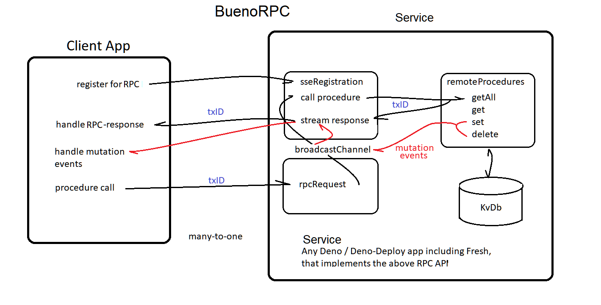

# Bueno-RPC
Remote Procedure Calls via Sever Sent Events   


## Early-days - WIP

This is an example **Deno-Deploy** kvDb-donor for accessing data remotely.   
We use a simple SSE-RPC service to fetch all DenoKv-db-rows.    
The TreeClient app will deconstruct all kvKeys for viewing in a DOM Treeview.  

SEE: Client-app https://github.com/nhrones/KvRPC_TreeClient

## Note: 
you can run this example service with:    
```
deno run -A --unstable server.ts    
```
Then in the TreeClient app (above), select **localhost Example** in the dropdown.    
    
The service is capable of allowing a remote client to perform full remote CRUD on the remote DB. 
This service also privides remote fileIO procedures.  
